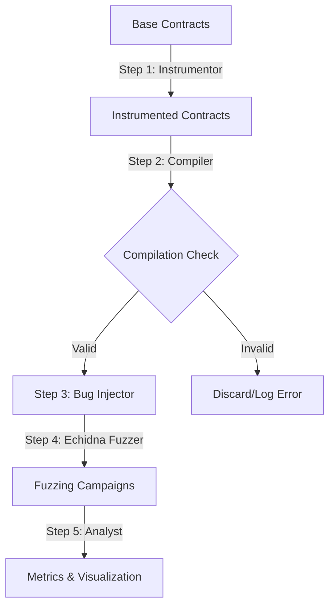

# Dynamic Reentrancy Bug Injection & Evaluation Tool

This tool is a research pipeline designed to evaluate the effectiveness of the **Echidna** property-based fuzzer in detecting reentrancy vulnerabilities. It is adapted from the methodology of **SolidiFI** (Ghaleb & Pattabiraman, 2020) and tailored specifically for dynamic reentrancy analysis.

The pipeline automates the orchestration of injecting reentrancy oracle components, compilation verification, injecting vulnerable patterns, running fuzzing campaigns under different intensities, and analyzing/visualizing the results.

---

## Architecture & Pipeline Flow

The workflow is divided into five core stages:



### Pipeline Steps
1. **Oracle Instrumentation (`step1instrumentor.py`)**: Inserts reentrancy tracking variables (`isReenteredHZ`, `lockedHZ`) and the Echidna oracle function (`echidna_reentrantCheck`) into clean base contracts.
2. **Compilation Verification (`step2compiler.py`)**: Compiles instrumented contracts using `solc` to ensure no syntax errors were introduced. Invalid contracts are excluded.
3. **Bug Injection (`step3injector.py`)**: Injects reentrancy vulnerabilities into the compiled contracts. Two variants are created per contract:
   - `single_function`: Reentrancy within a single function.
   - `cross_function`: Reentrancy spanning two separate functions sharing the same state.
4. **Echidna Fuzzing (`step4echidna.py`)**: Auto-generates attacker wrapper contracts, configures Echidna yaml files, runs fuzzing campaigns, and records raw logs and test results.
5. **Results Analysis & Visualisation (`step5analyst.py`)**: Computes evaluation metrics (Detection Rate, Activation Rate, Average Detection Time) and generates visualization charts.

---

## Prerequisites & Installation

### 1. System Requirements
- **OS**: Ubuntu / Linux (or Windows WSL2)
- **Solidity Compiler (`solc`)**: Version `0.8.23` (already managed via virtual environment artifacts)
- **Echidna**: Fuzzer binary installed and accessible in the system path (`/usr/local/bin/echidna`).

### 2. Setting Up Virtual Environment
All Python dependencies (like `matplotlib`, `numpy`, `PyYAML`, and `python-dotenv`) as well as the correct `solc` version are managed in the local `env` virtual environment.

Before running any script or pipeline command, **you must activate the virtual environment**:
```bash
source env/bin/activate
```
*Note: Activating the environment ensures that the correct python dependencies and the `solc` binary located in `env/bin/` are appended to your system path.*

### 3. Environment Variable Configuration
Create a `.env` file in the root directory (or use the existing one):
```env
ALCHEMY_RPC_URL="your-alchemy-rpc-url-here"
```

---

## How to Run (Single Configuration - `main.py`)

The single configuration pipeline uses the default settings in `config.py` and stores outputs in the root folder directories.

### Running the Entire Pipeline at Once
To run steps 1 through 5 sequentially:
```bash
# Activate environment
source env/bin/activate

# Optional: verify prerequisites
python3 main.py --check

# Execute full pipeline
python3 main.py
```

### Running Step-by-Step
You can execute each step in isolation. Each step relies on the output files saved to disk by the previous step:

> [!IMPORTANT]
> **Clean Directory First**: If you want to analyze a different set of contracts (e.g., analyzing 1 contract instead of all), you **MUST** clean the output directories first to remove stale files from previous runs.

```bash
# 1. Clean output directories
rm -rf instrumented_contracts/ injected_contracts/ echidna_results/ analysis_results/ logs/

# 2. Run Step 1 (Oracle Instrumentation)
python3 main.py --step 1

# 3. Run Step 2 (Compilation Verification)
python3 main.py --step 2

# 4. Run Step 3 (Bug Injection)
python3 main.py --step 3

# 5. Run Step 4 (Echidna Fuzzing)
python3 main.py --step 4

# 6. Run Step 5 (Results Analysis & Graphs)
python3 main.py --step 5
```

---

## How to Run (Multi-Experiment Comparative - `run_experiments.py`)

The multi-experiment orchestrator runs the pipeline across 3 different intensities (`exp1_light`, `exp2_medium`, `exp3_heavy`) to evaluate how fuzzer parameters affect performance.

> [!IMPORTANT]
> **Clean Directory First**: To reset the runs or evaluate a different set of contracts, clear the experiment subfolders first:
> `rm -rf experiments/*`

```bash
# Activate environment
source env/bin/activate

# Clean prior experiment results
rm -rf experiments/*

# Run all 3 experiments & comparison
python3 run_experiments.py

# Run a single experiment only
python3 run_experiments.py --exp exp2_medium

# Skip fuzzing and run comparative analysis on existing results
python3 run_experiments.py --compare-only
```

---

## Outputs & Structure
- **`contracts/`**: Base Solidity contracts to be fuzzed.
- **`instrumented_contracts/`**: Base contracts containing oracle property functions (Step 1 output).
- **`injected_contracts/`**: Instrumented contracts injected with vulnerable code patterns (Step 3 output).
- **`echidna_results/`**: Fuzzer wrappers, configurations, raw logs, and corpus results (Step 4 output).
- **`analysis_results/`**: Single-run metrics summaries and ECDF charts (Step 5 output).
- **`experiments/`**:
  - `_shared/`: Shared step 1-3 assets to optimize compile/injection time across experiments.
  - `exp1_light/`, `exp2_medium/`, `exp3_heavy/`: Per-experiment fuzzing results and metrics.
  - `comparison/`: Summary comparative CSVs, JSON reports, and combined benchmarking charts:
    - `cmp_chart1_detection_rate.png` (DR comparison)
    - `cmp_chart2_activation_rate.png` (AR comparison)
    - `cmp_chart3_ecdf_single_function.png` (ECDF - Single Function)
    - `cmp_chart4_ecdf_cross_function.png` (ECDF - Cross Function)
    - `cmp_chart5_avg_detection_time.png` (Average detection time)
